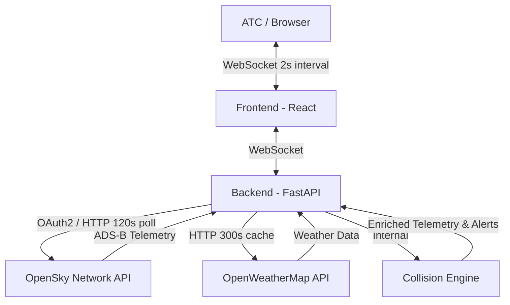

# Architecture

## System Architecture

The system is a real-time, physics-based aviation safety platform that operates primarily in memory to ensure low-latency alerts. It decouples external API polling from frontend updates using an internal cache, allowing for a fast 2-second UI refresh rate while strictly adhering to external API rate limits.

## Components

| Component | Technology | Responsibility |
|---|---|---|
| Frontend | React 18 (Vite, Tailwind, Leaflet) | ATC Tactical Display, map rendering, and visual preemptive alerts |
| Backend API | FastAPI (Python 3.11) | Orchestration, WebSocket client management, and external API polling |
| Collision Engine | Pure Python (Kinematic Math) | Airborne TCA pair-wise computation and ground stopping-envelope checks |
| Telemetry Source | OpenSky Network API | Providing live ADS-B aircraft state vectors (location, velocity, heading) |
| Weather Source | OpenWeatherMap API | Supplying real-time wind, visibility, and rain data for drift/friction penalties |

## Data Flow

Data moves through the system asynchronously, isolating the high-frequency UI updates from the low-frequency data ingestion:

1. The FastAPI Backend requests an OAuth2 token from OpenSky Network, automatically refreshing it 30 seconds before expiry.
2. The backend polls live aircraft state vectors for the 50km terminal geofence every 120 seconds.
3. Current weather conditions (wind, visibility, precipitation) are fetched every 300 seconds and cached in-memory.
4. The internal `CollisionEngine` processes the traffic and weather data, running pure-kinematic calculations to determine Time-to-Closest-Approach (TCA) and runway incursion risks.
5. The `WebSocket Manager` broadcasts the enriched state (aircraft data + generated alerts) to the React Frontend every 2 seconds from its internal cache.
6. The React Dashboard updates the UI instantly, applying Preemptive-Event-Red (P-E-R) pulsing and countdown timers for active alerts.

## Security Considerations

- External API credentials (`OPENSKY_CLIENT_ID`, `OPENWEATHER_API_KEY`, etc.) are stored purely in `.env` variables and excluded from version control.
- OAuth2 token management is handled strictly server-side by the `TokenManager`; access tokens are never exposed to the frontend browser.
- The system gracefully degrades to a deterministic offline mock generator if credentials are not provided, preventing application crashes and avoiding unwanted API calls.

## Scalability Notes

The architecture is highly optimized for strict rate-limiting (staying under a 1,000 requests/day budget). 
To scale this beyond a single 50km terminal zone prototype:
- The FastAPI backend is stateless regarding client connections. It can be horizontally scaled behind a load balancer by introducing a centralized Redis Pub/Sub layer to manage WebSockets across multiple nodes.
- The `CollisionEngine` operates completely independently of I/O. Its pure-math workload could be parallelized or distributed by partitioning the airspace into independent computational sectors.
