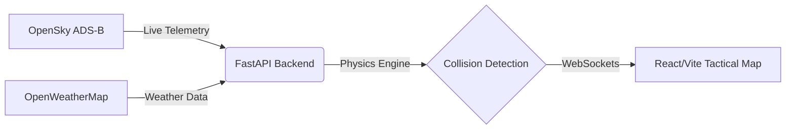

# Solution Overview

## What We Built

We built a real-time Air Traffic Control (ATC) safety dashboard designed to proactively prevent collisions. It ingests live flight telemetry and weather data, processes it through a custom physics-based collision engine, and streams actionable alerts to a live tactical map. Rather than just displaying current aircraft positions, the system predicts future conflicts for both airborne and ground traffic, providing controllers with critical lead time and clear resolution advisories to manage crowded airspace safely.

## How It Works

1. **Data Ingestion:** The FastAPI backend securely fetches live aircraft positions (via OpenSky Network ADS-B) and local weather conditions (via OpenWeatherMap) every two seconds.
2. **Conflict Prediction:** Our pure-mathematics collision engine evaluates the data, calculating a 60-second time-to-closest-approach for airborne traffic (using cylindrical separation) and modeling weather-adjusted forward stopping envelopes for ground traffic.
3. **Live Streaming:** The processed airspace state, complete with generated resolution advisories and countdown timers, is cached and continuously broadcast via WebSockets.
4. **Tactical Visualization:** A React-Leaflet frontend renders a 50 km geofenced airspace and runway line-segment geometry. Aircraft are dynamically highlighted based on threat levels, presenting actionable alerts directly to the controller.

## Architecture Diagram

> See [`architecture.md`](architecture.md) for the detailed diagram.

## Key Design Decisions

| Decision | Rationale |
|---|---|
| **Pure-Mathematics Collision Engine** | Opted for a deterministic physics model rather than machine learning to ensure highly predictable, transparent, and immediate conflict calculations. |
| **WebSocket Telemetry Streaming** | Standard HTTP polling caused too much latency for live ATC operations; WebSockets with a 2-second cached broadcast provided the necessary real-time fluidity. |
| **Separate Horizontal & Vertical Checks** | Modeled airborne safety using cylindrical thresholds rather than spherical ones to accurately reflect real-world aviation altitude and distance separation standards. |
| **In-Memory Caching** | Used in-memory data structures for active flight states and JSON airport configurations to minimize read/write latency during rapid update cycles. |

## IBM Technologies Used

- **IBM Bob:** Used exclusively during the development phase as an intelligent assistant for code review and debugging. We leveraged it to help identify complex logic edge-cases within our mathematics engine and to troubleshoot WebSocket latency issues, ensuring the system was highly performant before deployment.
